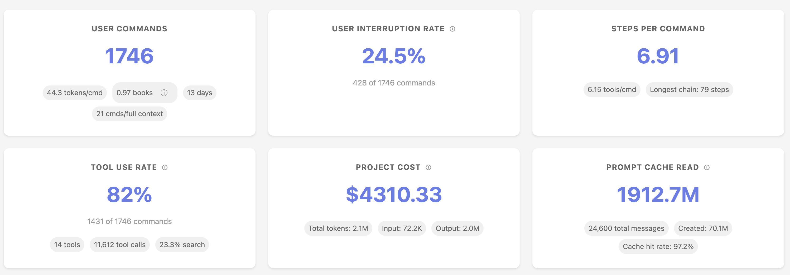
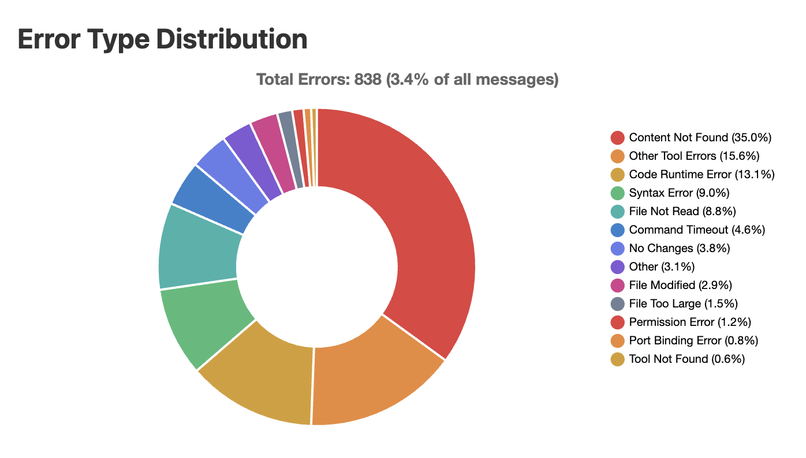
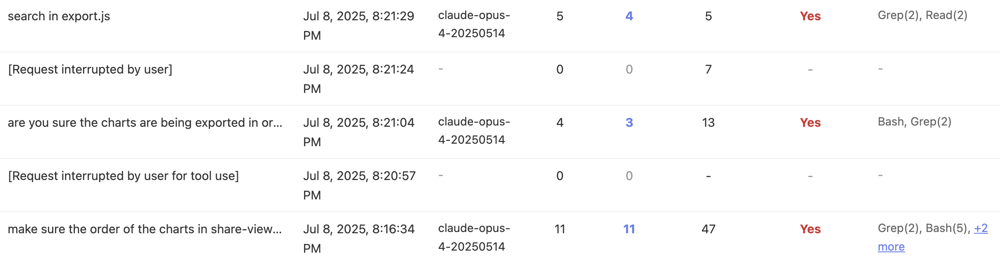

# Sniffly - Claude Code 分析仪表板

分析 Claude Code 日志，帮助您更好地使用 Claude Code。

* [官网](https://sniffly.dev)
* [快速开始](#-快速开始)
* [功能特性](#-功能特性)
* [可分享的仪表板](#-分享您的仪表板)

## 📊 功能特性
### 了解您的使用模式
<center>

</center>

### 错误分析
_查看 Claude Code 在哪里犯错，以便您避免这些错误。_

<center>

</center>

### 消息历史分析
_浏览您的所有指令，并在需要时与同事分享。_

<center>

</center>


## 🚀 快速开始
- 需求：Python 3.10+

### 使用 UV（推荐）
确保您已安装 `uv`！https://github.com/astral-sh/uv

```bash
# 一次性执行（无需安装）
uvx sniffly@latest init
```

```bash
# 安装软件包
uv tool install sniffly@latest
sniffly init
```

运行 `sniffly init` 后，在 http://localhost:8081（或您选择的任何端口）访问您的仪表板。

### 使用 pip

```bash
pip install sniffly
sniffly init
```

### 从源代码安装
```bash
git clone https://github.com/chiphuyen/sniffly.git
cd sniffly
pip install -e .
sniffly init
```

## 🔧 配置

### 常用设置

```bash
# 更改端口（默认：8081）
sniffly config set port 8090

# 禁用自动打开浏览器
sniffly config set auto_browser false

# 显示当前配置
sniffly config show
```

### 所有配置选项

| 键 | 默认值 | 描述 |
|-----|---------|-------------|
| `port` | 8081 | 服务器端口 |
| `host` | 127.0.0.1 | 服务器主机 |
| `auto_browser` | true | 启动时自动打开浏览器 |
| `cache_max_projects` | 5 | 内存缓存中的最大项目数 |
| `cache_max_mb_per_project` | 500 | 每个项目的最大 MB 数 |
| `messages_initial_load` | 500 | 初始加载的消息数 |
| `max_date_range_days` | 30 | 日期范围选择的最大天数 |

查看完整的 [CLI 参考](docs/cli-reference.md) 以了解所有选项和命令。


## 💡 分享您的仪表板
您可以创建一个链接来与同事分享您项目的统计数据和指令。

1. 点击仪表板中的“📤 分享”按钮
2. 选择隐私选项：
   - **私密**：仅拥有链接的人可以查看
   - **公开**：在公开展示中列出
   - **包含命令**：分享您的实际命令文本
3. 复制并分享生成的链接

## 🚨 故障排除

### 常见问题

```bash
sniffly help
```

**端口已被占用？**
```bash
# 使用不同的端口
sniffly init --port 8090

# 或更改默认值
sniffly config set port 8090
```

**浏览器没有打开？**
```bash
# 检查设置
sniffly config show

# 启用自动打开浏览器
sniffly config set auto_browser true

# 或手动访问 http://localhost:8081
```

**配置问题？**
```bash
# 查看所有设置及其来源
sniffly config show

# 将设置重置为默认值
sniffly config unset port

# 删除所有自定义配置
rm ~/.sniffly/config.json
```

更多问题，请参阅 [GitHub Issues](https://github.com/chiphuyen/sniffly/issues)。

## 🔐 隐私

Sniffly 完全在您的本地机器上运行：
- ✅ 所有数据处理都在本地进行
- ✅ 无遥测
- ✅ 您的对话永远不会离开您的计算机
- ✅ 共享仪表板仅在您选择后才会启用

## 📄 许可证

MIT 许可证 - 请参阅 [LICENSE](LICENSE) 文件。

## 🔗 链接

- **主页**：[sniffly.dev](https://sniffly.dev)
- **文档**：[完整 CLI 参考](docs/cli-reference.md)
- **问题**：[GitHub Issues](https://github.com/chiphuyen/sniffly/issues)
